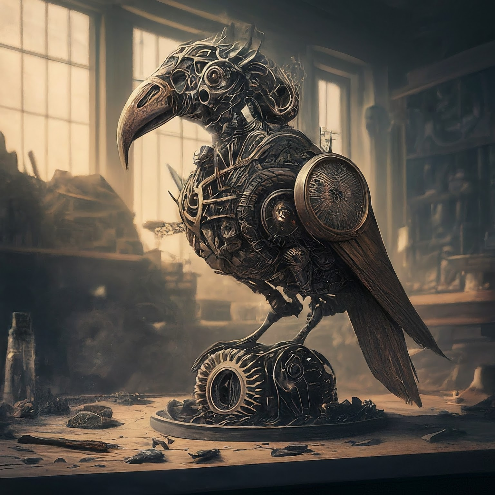

|  |  |  |
| --------------------------------- | ----------------------------------- | ----------------------------------- |

##### _art by Gemini_

# mechanise

Mechanise is a Rust library that provides a simple and intuitive interface for interacting with the Anthropic's `messages` REST API.

It exists because getting llms to write an API for themselves has become somewhat of a pastime of mine to evaluate them.

## Goals:

- Easy-to-use API.
- Convenient methods for generating content.
- Have these goals met by llms predominantly writing most of the code.

## Usage

To get started with Mechanise, add it as a dependency to your Rust project's `Cargo.toml` file:

```toml
[dependencies]
mechanise = "0.1.0"
```

or, `cargo add mechanise` if that's your preferred method of adding dependencies.

After adding Mechanise as a dependency, you will need to obtain an [API key](https://console.anthropic.com/settings/keys) to interact with the services.

Make sure to set the `ANTHROPIC_API_KEY` environment variable with your API key before running your application.

Then, in your `main.rs`:

```rust
#[tokio::main]
async fn main() -> Result<(), AnthropicError> {
    let client = AnthropicClient::new();
    let messages = vec![Message {
        role: "user",
        content: "Write me a rust function that can generate secure passwords",
    }];
    let response = client
        .create_message("claude-3-opus-20240229", 128, messages)
        .await;

    match response {
        Ok(res) => {
            println!("Response: {:?}", res);
        }
        Err(err) => {
            panic!("Error: {}", err);
        }
    }

    Ok(())
}
```

> NOTE: `AnthropicError` will `#transparent` most of / all of the errors possible from the dependency crates so be aware of that should you encounter problems.

## Testing

To run the tests for Mechanise, use the following command:

```sh
cargo test
```

## Contributing

Contributions to Mechanise are welcome! Please feel free to open an issue or submit a pull request if you have improvements or bug fixes.

## License

Mechanise is licensed under the MIT License.


## Resources like this (I've not looked at these past a crates.io search)
https://crates.io/crates/anthropic
https://crates.io/crates/claude_cli